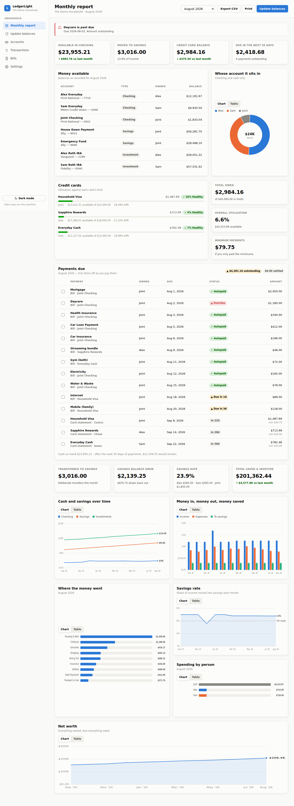

# LedgerLight

A monthly finance report for a two-person household. It answers four questions
on one page:

- **How much is available** in the checking accounts, yours, theirs and joint
- **What the credit cards owe**, their utilisation, and **what is due when**
- **How much went into savings** this month, and whether that hit your target
- **What it all looks like over time** — cash, savings, income vs spending,
  category breakdown, savings rate and net worth

It runs on your own machine. There is no account, no sync and no third-party
service; the data sits in a JSON file you can read, back up and delete.



## Running it

Requires Node 20.6 or newer. There are **no dependencies to install.**

```bash
node server/index.js      # or: npm start
```

Then open <http://127.0.0.1:4321>.

To look around before entering anything real, load the demo household — two
earners, joint and personal accounts, three cards, a car loan and 14 months of
history:

```bash
npm run seed        # writes data/finance.json (refuses to clobber real data)
npm start
```

`npm run seed:force` replaces an existing ledger. The server reads the file once
at startup, so stop it before seeding.

Useful environment variables:

| Variable | Default | Purpose |
|---|---|---|
| `PORT` | `4321` | Port to listen on |
| `HOST` | `127.0.0.1` | Bind address — loopback only by default |
| `FINANCE_DATA` | `./data/finance.json` | Where the ledger lives |

## Setting up your accounts

Typing twenty accounts into a form is miserable, so the household is defined as
a list you can edit — `setup/household.json` — and applied with one command:

```bash
npm run setup:dry      # show what it would do, change nothing
npm run setup          # apply it
```

It is **idempotent**: accounts are matched on name *and* owner, bills on name,
and anything already present is left untouched. So when you open a new card,
add a line to `setup/household.json` and run `npm run setup` again — only the
new entries are created, and nothing you have edited by hand is overwritten.

Two accounts in a household can legitimately share a name (you and your partner
may both hold the same card). That is supported: they are distinguished by
owner, and any name used more than once is qualified with its owner wherever it
appears in a dropdown.

A bill with no `amount` yet is created **inactive**, so unfilled stubs never
show up as overdue $0 obligations. Give it an amount and a due day in the Bills
screen, tick Active, and it joins the monthly checklist.

## The monthly routine

Once accounts are set up, the recurring work is **one number per account**:

1. **Update balances** — one screen listing every account with the previous
   month's figure beside the input, so a typo stands out. Credit cards also take
   the statement balance, minimum payment and due date. Tab moves between
   fields and **Enter saves**; leaving a blank keeps last month's value, and
   navigating away with figures still typed asks before discarding them.
2. **Monthly report** — reads back the whole picture for that month.
3. **Payments due** — tick items off as you pay them. Ticking is per month, so
   the history stays intact.

Categorised spending charts need transactions, which you can add by hand or
import from a bank CSV export (**Transactions → Import CSV**). Date,
description and amount columns are detected automatically, including exports
that use separate debit/credit columns, and rows identical to ones already
imported are skipped so overlapping statements don't double-count.

## How the numbers are worked out

**Balances come from monthly snapshots, not from summing transactions.** You
record what the bank actually says. If you skip a month, the last known balance
is carried forward and flagged rather than dropping the account out of the
report — a forgotten update never silently reads as zero.

**Credit and loan balances are stored positive** (as the amount owed), which is
how a statement reads. Net worth is assets minus liabilities.

**A loan and its monthly payment are two different things, and both are worth
recording.** The loan *account* holds what you still owe, so it lowers net
worth and shows the principal coming down month by month. The *bill* holds the
monthly payment, so it appears in payments due. They never double-count: only
bills and credit-card statements ever become obligations.

If you track a mortgage, record the property as an account too (type
**Property**). Otherwise net worth carries the debt without the asset on the
other side and reads far more negative than the truth. Property is an asset but
is never counted as money available.

**Saving is measured two ways, because they answer different questions:**

- *Transferred to savings* — money you deliberately moved into a savings or
  investment account. This is what the savings rate divides by income.
- *Savings balance grew* — the month-over-month change in savings balances,
  which also includes interest and market movement. The difference between the
  two is reported separately as passive growth.

**A transfer is never income or an expense.** Moving money between your own
accounts doesn't change what the household has, so transfers are excluded from
both sides of the cash-flow figures. A card payment is tracked as debt
repayment, not spending — the spending was recorded when the card was charged.

**Money is stored as integer cents throughout.** No balance is ever held as a
floating-point number.

## Data, backups and privacy

Everything lives in `data/finance.json`. Writes are atomic — a temp file that is
`fsync`ed and renamed over the original — so an interrupted save cannot leave a
truncated ledger. Every mutation first copies the current file into
`data/backups/`, keeping the last 20 versions.

`data/` is gitignored. To move your ledger to another machine, copy that folder;
or use **Settings → Download backup** for a single JSON file, and **Restore from
backup** to load it.

The server binds to `127.0.0.1`, so it is not reachable from other machines on
your network unless you deliberately set `HOST`. Nothing is fetched from a CDN —
fonts, icons and charts are all local — so the app works fully offline and no
outside party sees a request when you open it.

## Layout

```
server/       HTTP server, JSON store, validation, seed generator
shared/       Report engine, money/date/CSV helpers — used by server and browser
public/       Frontend: no build step, ES modules straight to the browser
test/         Report engine tests (node --test)
```

`shared/report.js` is the whole reporting model and is pure — it takes a plain
data object and returns the report, with no I/O — so it can be tested directly
and reused anywhere.

```bash
npm test
```

## Charts

Charts are hand-drawn SVG with no charting library. The palette is a validated
categorical set with separately chosen light and dark steps, so series stay
distinguishable under the common forms of colour blindness. Identity is never
carried by colour alone: every multi-series chart has a legend, series are
direct-labelled at their endpoints, status colours always ship with an icon and
a word, and every chart has a **Table** toggle that shows the same numbers as
text.

## Limitations worth knowing

- Single household, single machine. There is no authentication, because there is
  nothing to authenticate against — do not expose it to the internet by setting
  `HOST=0.0.0.0` on an untrusted network.
- No bank syncing. Balances are entered by hand each month; transactions can be
  CSV-imported but not fetched.
- Multi-currency is not supported; all accounts are assumed to be in the
  currency set in Settings.
- Investment balances track what you record. There is no market data feed.
